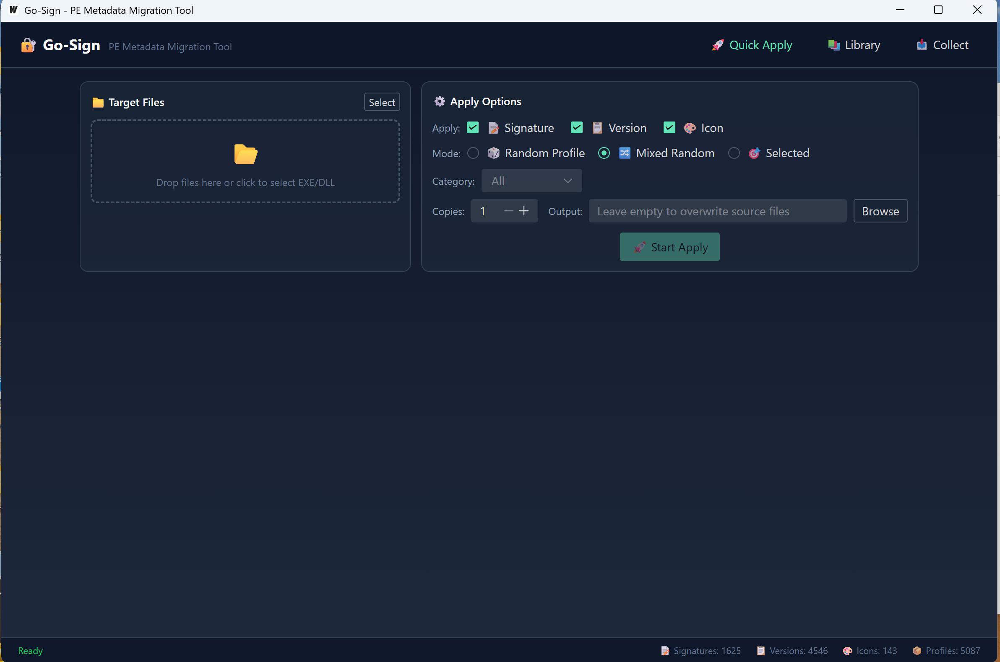

# Go-Sign

Go-Sign is a Windows desktop tool for migrating selected PE metadata between
authorized EXE and DLL files. This repository contains the English binary
release only; source code is not included.



## Download

Download [`go-sign.exe`](go-sign.exe) and run it on a 64-bit Windows system.

## Requirements

- Windows 10 or Windows 11, 64-bit
- Microsoft Edge WebView2 Runtime
- Permission to read and modify the selected files

## Usage

### Collect metadata

1. Open the **Collect** tab.
2. Select a source EXE or DLL, or choose a directory for batch collection.
3. Choose the metadata types to collect: **Signature**, **Version**, and/or
   **Icon**.
4. Optionally assign a category and tags.
5. Click **Start Collection**.

### Apply metadata

1. Open the **Quick Apply** tab.
2. Drag target EXE or DLL files into the target area, or click **Select**.
3. Choose which metadata to apply: **Signature**, **Version**, and/or **Icon**.
4. Select a mode:
   - **Random Profile** uses one complete profile.
   - **Mixed Random** selects metadata items independently.
   - **Selected** uses a profile chosen from the library.
5. Set the number of copies and an output directory. Leaving the output field
   empty overwrites the source files.
6. Click **Start Apply**.

### Manage the library

Use the **Library** tab to browse, search, inspect, and remove collected
profiles and metadata assets.

## Important Notes

- Back up every target file before applying changes.
- Use this tool only with software you own or are explicitly authorized to
  test.
- Copying an Authenticode certificate table does not create a new trusted
  signature. Windows signature validation also depends on the file digest,
  certificate chain, and signing process.
- Security products may flag software that modifies PE metadata. Review the
  binary in an isolated test environment before production use.

## File Integrity

SHA-256 for `go-sign.exe`:

```text
f4a54781c3dba3046fd142782985d4e605fb8e20a9c17195aa71e4aeed1f7f9e
```

## Release Contents

- `go-sign.exe` - English Windows x64 application
- `docs/go-sign-interface.png` - English interface screenshot
- `README.md` - English usage documentation
